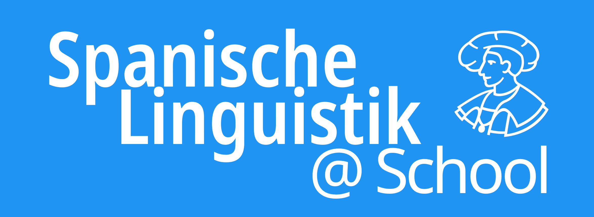

  
  

    
Ein digitales Sachbuch für Spanischlehrkräfte

    
Koordination

    
Prof. Dr. Felix Tacke

    
Autor:innen

    
Gloria Gabriel, Marlon Merte, Felix Tacke

    
Philipps-Universität Marburg, 2025

    

      
    

  

## Worum geht es hier?

Du befindest dich auf der Startseite eines digitalen Sachbuchs, das sich an (zukünftige) Spanischlehrer:innen richtet. Es soll die wichtigsten Themen der spanischen Sprachwissenschaft behandeln und dabei – hier liegt der besondere Fokus – die Relevanz und Nützlichkeit linguistischer Kompetenz für den Spanischunterricht beleuchten.

Die Idee zu diesem digitalen Sachbuchprojekt ist nicht aus dem Nichts entstanden, sondern wurde inspiriert durch viele Unterhaltungen mit meinem Kollegen **Rolf Kreyer**, Professor für englische Sprachwissenschaft an der Philipps-Universität Marburg und anerkannter Spezialist für eine linguistisch fundierte Lehrkräftebildung. Sein 2023 publiziertes Lehrbuch (sein *Linguistic Toolkit*, s.u.) ist das Vorbild und bildet den Hintergrund, vor dem hier an einem digitalen "Toolkit" für (angehende) Spanischlehrkräfte gearbeitet wird.

!!! details "Referenzwerk für das Englische"
    **Rolf Kreyer (2023):** *The Linguistic Toolkit for Teachers of English: Discovering the Value of Linguistics for Foreign Language Teaching.*  Tübingen: Narr Francke Attempto Verlag. [Zum eBook](https://www.narr.de/the-linguistic-toolkit-for-teachers-of-english-18611/){target="_blank" rel="noopener noreferrer"}

Eine ausführlichere Darstellung der Grundidee findest Du in der [Einleitung](einleitung.md). Wenn Du sofort starten möchtest, kannst Du über die Navigation auch direkt in eines der Kapitel springen.

Bei diesem digitalen Buch handelt es sich um „work in progress“. Die sich jeweils in Arbeit befindlichen Kapitel tragen daher den Zusatz „(Beta)“, um darauf hinzuweisen, dass es sich zunächst noch um zur (internen) Diskussion stehende Texte handelt. Ein [Template](template.md) gibt Orientierung zu Gestaltungsmöglichkeiten und Layout.

*Marburg, im April 2025*

*Prof. Dr. Felix Tacke*

!!! info "Dieses Buch zitieren"  
    Tacke, Felix (Koord.) (2025–): *Spanische Linguistik @ School*. Marburg: Universität Marburg. Online: [https://linguistik.online.uni-marburg.de/](https://linguistik.online.uni-marburg.de/){target="_blank" rel="noopener noreferrer"}  
      
    {target="_blank" rel="noopener noreferrer"}
